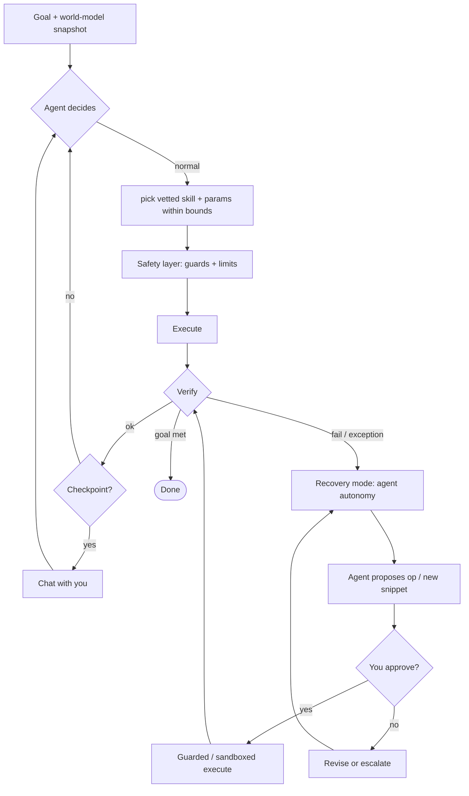

# AI-agent orchestration plan

Goal: an orchestration engine that **doesn't hardcode "next"** and stays flexible, driven by
a Claude agent (Agent SDK / tool-use), with a human able to make decisions **with** the agent
while a run is in progress. Two operating modes, one always-on safety spine.

## Two modes

**Normal mode — supervised & bounded (step-by-step).**
The agent selects the next action each step from the world-model state, but only from
**vetted skills / pre-defined step snippets**, and may **tune parameters within configured
bounds** (speeds, standoffs, retries, grasp width). Deterministic execution + verification.
The run **chats with you at checkpoints** (e.g. before the uncap, before aspirate) and
continues on your call.

**Recovery mode — gated autonomy (on error/uncertainty).**
Triggered when a verification fails or an exception occurs. The agent gets **full autonomy
to diagnose and recover**, richer context (failure, camera frames, history), and may **propose
new operations or code snippets, potentially outside verified bounds**. It must
**propose → you approve → execute (guarded) → verify**. On success, resume normal mode; else
re-attempt within a budget, then escalate to you.

## The split: brain vs spine

- **Brain (flexible):** the Claude agent — decides *what* to do, tunes, diagnoses, proposes.
- **Spine (deterministic, non-negotiable):** the executor + **safety layer** enforces *how*
  things are allowed to happen, and it cannot be bypassed by the agent in either mode:
  the anti-spill upright guard, waypoint discipline (safe height → approach-above → vertical
  final approach), soft joint/speed limits, collision detection, and e-stop.

## Tools exposed to the agent (Agent SDK)

Read: `get_world_model()`, `get_entity(id)`, `get_camera_frame(cam)`, `list_skills()`,
`list_teachpoints()`, `get_param_bounds()`, `history()`.
Act (normal): `call_skill(name, params)`, `goto_teachpoint(name)`, `tune(param, value)` (clamped).
Act (recovery, gated): `propose_operation(plan)`, `propose_snippet(code)`, `request_approval(...)`,
`request_human(question)`, `checkpoint(summary)`.

The agent's situational awareness each decision = goal · world-model snapshot (entities, poses,
states) · last action + verification result · available skills/teachpoints · param bounds ·
recent history · optional camera frames (multimodal).

## Safety model (critical — applies in both modes)

1. **Guards are always on.** Every commanded motion passes the deterministic safety layer
   regardless of what the agent asked for. The agent cannot disable it.
2. **Bounded tuning.** `tune()` values are clamped to config ranges; out-of-range is rejected.
3. **Generated snippets are contained.** Proposed code (recovery mode) runs in a restricted
   namespace exposing only the safe capability API, is **dry-run against the world model / sim
   first**, requires **explicit human approval** before touching hardware, and still passes
   through the guard layer.
4. **Two-key for out-of-bounds.** Anything outside verified bounds needs your approval.
5. **Everything is logged** (decisions, params, approvals, outcomes) — audit trail + demo narrative.

## Teachpoints ↔ world model (backbone)

Teachpoints are ground truth in the arm frame; the world model is the live relational scene in
the world frame; the `arm_base → world` calibration transform bridges them. Teachpoints
(1) **calibrate/ground** the twin (hand-taught references solve the transform tree) and
(2) **define entity anchors** (a taught grasp/present pose attaches to an entity as its anchor).
The agent can reach a target by **replaying a teachpoint** (repeatable, IK-free) or **computing
from the twin** (entity pose + anchor offset; adapts to vision). Verification compares live twin
pose vs expected (teachpoint/anchor) within tolerance; on disagreement, policy or the agent (at a
checkpoint) decides — teachpoint as trusted fallback, vision for adaptation. Store each teachpoint
with optional `entity_id` + `anchor_name` so the two stay linked.

## Integration with this repo

- Replace the hardcoded `PLAN` in `workflows/uncap_aspirate.py` with the agent-driven loop; keep
  each step as a **skill** (so normal mode picks from them).
- Agent client as a service (`core/agent/` or a backend service); tools map to `drivers`
  capabilities + `worldmodel` (twin) + `verification` agents + `teach` (teachpoints).
- `services/twin.py` is the shared state the agent reads; `verification/agents.py` provides
  `verify()`; `motion/pick_place.py` guard is part of the spine.
- UI: checkpoint chat panel + approval gate + live twin view + proposed-snippet diff/dry-run.
- Optional **Prefect** outer wrapper for retries/observability (consistent with the existing
  `run_prefect_workflow_phases` tooling) — wrap each *action*, keep decision + recovery in the agent.

## Phased build (hackathon-scoped)

- **P0 — normal loop:** goal + tool schema; agent reads twin, picks among existing skills,
  deterministic execute + verify, chat checkpoints. (No tuning, no recovery yet.)
- **P1 — bounded tuning + approval gate.** `tune()` clamped; approval UI.
- **P2 — recovery from a library.** Agent selects/parameterizes pre-built recovery actions
  (regrasp, re-approach, re-localize) with approval.
- **P3 (stretch) — generated snippets.** Agent authors recovery code; sandbox + dry-run + approval.

## Risks & mitigations

- **LLM latency per step** → normal mode can plan a few steps ahead and only re-decide on change;
  use a fast model for routine steps, escalate to a stronger model for recovery.
- **Safety of generated code** → sandbox + guards + sim dry-run + human approval (never direct-to-hardware).
- **Demo determinism** → the happy path is skill-based and repeatable; the agent adds flexibility,
  not chaos; deliberate failure injection shows recovery on cue.
- **Hallucinated tool args** → schema validation + the guard layer rejects unsafe commands.
