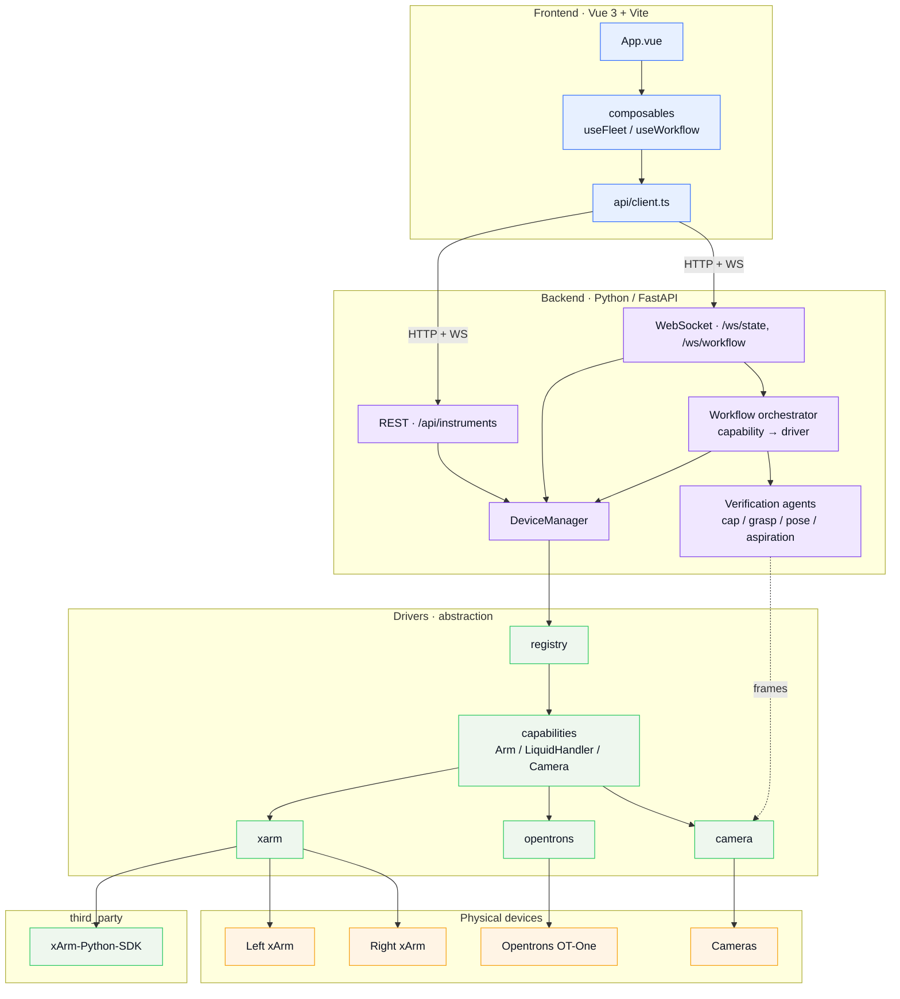

# Software architecture

Three layers with a strict dependency direction: **frontend → backend → drivers → devices**.
The backend depends only on driver *interfaces*; vendor SDKs stay behind the driver layer.

## Layer responsibilities

- **frontend/** — presentation only; talks to the backend over REST + websockets.
- **backend/** — orchestration (the workflow state machine), verification agents, and the
  API. The *middle layer* that maps required capabilities to concrete drivers.
- **drivers/** — capability interfaces + one driver per instrument, created by a registry.
  Swap real hardware for mocks by registering a different factory under the same type.
- **third_party/** — vendored vendor SDKs, referenced only by their driver.
