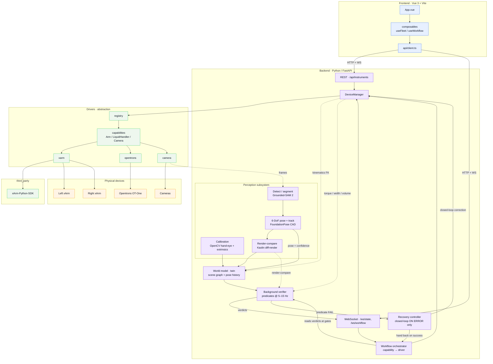

# Software architecture

Three layers with a strict dependency direction: **frontend → backend → drivers → devices**.
The backend depends only on driver *interfaces*; vendor SDKs stay behind the driver layer.

## Layer responsibilities

- **frontend/** — presentation only; talks to the backend over REST + websockets. Also
  renders perception overlays (masks, pose axes, render-compare diff) and predicate verdicts.
- **backend/** — orchestration (the workflow state machine), the **perception subsystem**,
  the **world-model twin**, background verification, recovery, and the API. The *middle
  layer* that maps required capabilities to concrete drivers.
- **drivers/** — capability interfaces + one driver per instrument, created by a registry.
  Swap real hardware for mocks by registering a different factory under the same type.
- **third_party/** — vendored vendor SDKs, referenced only by their driver.

## Perception subsystem → twin → verify → recover

This is the world-model loop. It extends the twin design in `docs/DIGITAL_TWIN.md` and is
specified in `docs/WORLD_MODEL_REQUIREMENTS.md`. Two principles shape it:

- **Verification is a background process** — it runs continuously, not per workflow step.
- **Control is closed-loop only on error** — nominal motion is open-loop; a perception→motion
  loop engages *only* when a predicate fails, then hands back.

Data flow:

1. **Calibration** (`backend/app/calibration/`, OpenCV) fixes intrinsics, the on-arm
   **hand-eye** transform, and fixed-camera **extrinsics** into one shared world frame with
   metric scale. Artifacts persist under `calib/`.
2. **Detect / segment** (Grounded-SAM 2 — Grounding DINO text prompts → SAM2 masks) finds
   tube, cap, and nozzle and seeds/re-seeds the pose tracker. Open-vocabulary, so new
   labware needs config only.
3. **6-DoF pose + track** (FoundationPose, CAD-model mode) initializes once from the mask +
   depth, then runs refine-only *tracking* fast enough for the background loop. **BundleSDF**
   is the model-free fallback for objects without a CAD mesh (off the hot path).
4. **Render-compare** (Kaolin differentiable renderer) scores hypothesized CAD poses against
   the live frame — used both to sharpen pose and as evidence for geometric predicates.
5. **World model** fuses perception poses (with confidence + staleness gating) and always-on
   kinematics FK into the `WorldModel` scene graph, reparenting entities on manipulation and
   keeping a per-entity pose history.
6. **Background verifier** re-evaluates predicates (`cap_removed`, `grasp_secure`,
   `tube_aligned`, `aspiration_ok`) at 5–15 Hz as twin queries, fusing render-compare and
   driver telemetry (torque / gripper width / OT volume). Verdicts stream to the UI; the
   orchestrator reads them at step gates.
7. **Recovery controller** engages **only** on a failed/low-confidence predicate: re-localize,
   visual-servo re-align, or regrasp — bounded by max attempts, then **stop and request help**.
   On success it hands control back to the open-loop orchestrator.

### Where each dependency lives

Vendor / model dependencies stay inside the perception subsystem and never leak upward.
OpenCV, SAM2 (Apache-2.0), Grounding DINO (Apache-2.0), FoundationPose (NVIDIA Source Code
License, **non-commercial**), BundleSDF (non-commercial), and Kaolin (Apache-2.0 core;
`non_commercial` NSCL) are all used under **non-commercial** terms — see
`docs/WORLD_MODEL_REQUIREMENTS.md` §NFR-LICENSE-1 for the swaps required if this ever goes
commercial. Recovery drives the same `drivers/capabilities/` interfaces as nominal motion,
so no vendor SDK is imported above the driver layer.
