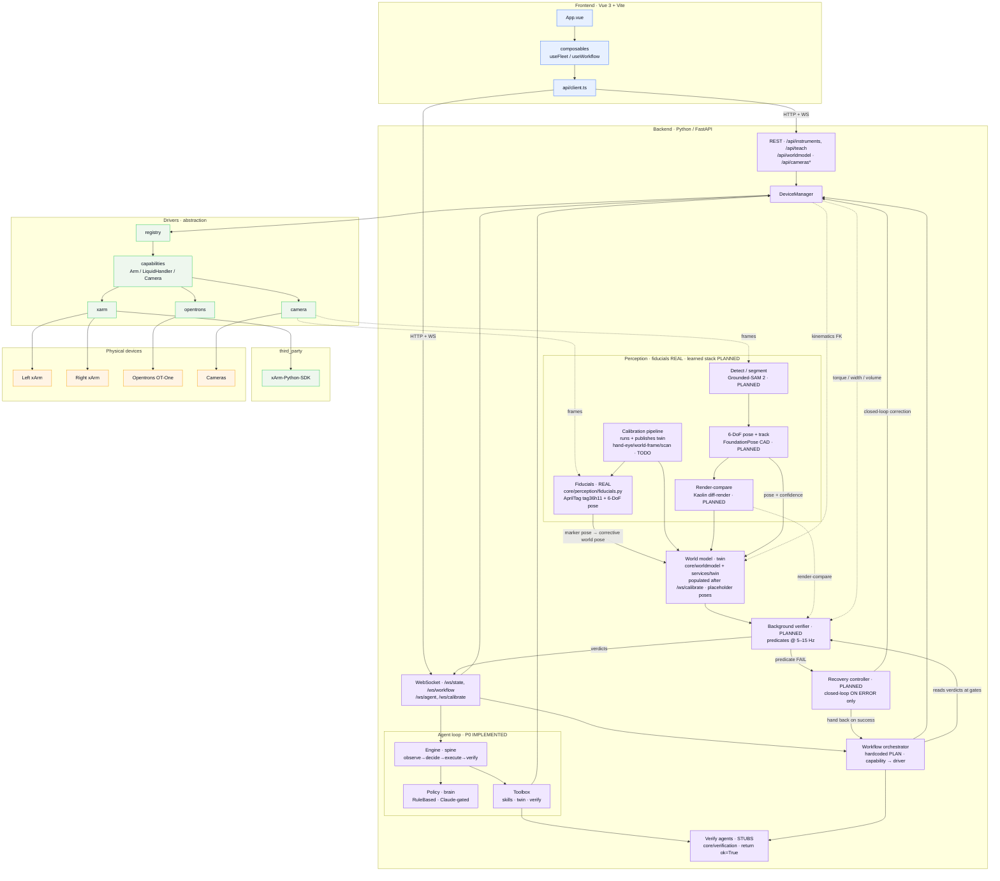

# Software architecture

Three layers with a strict dependency direction: **frontend → backend → drivers → devices**.
The backend depends only on driver *interfaces*; vendor SDKs stay behind the driver layer.

## Implementation status (reflects code on disk)

The diagram is the **target** architecture; nodes are annotated with what is real today.

- **Real:** the driver layer + registry, `DeviceManager`, the hardcoded `WF` orchestrator, the
  **P0 agent loop** (`backend/app/agent/`, streamed on `/ws/agent`), the world-model *entity model*
  (`core/worldmodel/` + CAD tube/cap meshes) and the `services/twin.py` holder, and the REST/WS API.
  **Fiducial perception is now real:** `core/perception/fiducials.py` detects AprilTag `tag36h11`
  and estimates 6-DoF marker pose (OpenCV `aruco` + `solvePnP` IPPE_SQUARE), with
  `entity_world_pose()` composing the corrective world pose (test: `backend/tests/test_fiducials.py`).
  The **calibration pipeline** (`core/calibration/pipeline.py`, streamed on `/ws/calibrate`) now runs
  end-to-end and **publishes the twin** (`twin.set_world`): it connects the fleet, registers skeleton
  geometry (tip box + tube rack) and seeds a demo tube, so `services/twin.get_world()` is populated
  after a calibrate run. The xArm driver runs the real vendor SDK; other drivers have mock counterparts.
  The **camera path is now live end-to-end:** `main.py` mounts `cameras.router`
  (`backend/app/api/cameras.py`, MJPEG `/api/cameras/{id}/stream` + `/detections`) backed by a
  worker-threaded `services/camera_hub.py`, and its per-camera detections ride `/ws/state`; a
  RealSense RGB-D driver (`drivers/camera/realsense.py`) exists on disk (uncommitted WIP) covering all
  three fixed viewpoints. The **workflow orchestrator streams** over `/ws/workflow` with a
  `/api/workflow/plan` endpoint, and the **teach layer** (jog / move-to / pose library) is hardened and
  tested (`backend/tests/test_teach_api.py`).
- **Stub / no-op:** every `core/verification` agent returns `ok=True, confidence=0.0` — so the
  verify→retry loop cannot currently fail. The hero workflow's `_execute` (also reused by the agent
  toolbox's `Skill.run`) has its driver calls commented out, so both the hardcoded chain and the agent
  loop "pass" against empty actions and no autonomous motion occurs. Calibration's `hand_eye` /
  `world_frame` / `arm_to_arm` / scan steps are still `TODO`, so twin poses are placeholder (the
  `PlaceholderScanAdapter`); `MARKER_MAP` now uses **real** printed stock ids (`tag36h11` 180–224) but
  keeps `identity()` marker→entity offsets (0.02 placeholder) — real alignment still needs measured
  values. The OT-One driver's `connect()` / `_send()` remain `TODO` (a `feat/ot-one-serial-driver`
  branch exists on `origin` but is not merged here), so no real aspirate has run.
- **Planned, no code yet:** the learned **perception stack** (Grounded-SAM 2 / FoundationPose /
  Kaolin render-compare), the **background verifier**, and the **recovery controller**. None of the
  learned-perception model dependencies are installed; fiducial detection needs only
  `opencv-contrib-python`.

## Layer responsibilities

- **frontend/** — presentation only; talks to the backend over REST + websockets. Also
  renders perception overlays (masks, pose axes, render-compare diff) and predicate verdicts.
- **backend/** — orchestration (the workflow state machine), the **perception subsystem**,
  the **world-model twin**, background verification, recovery, and the API. The *middle
  layer* that maps required capabilities to concrete drivers.
- **drivers/** — capability interfaces + one driver per instrument, created by a registry.
  Swap real hardware for mocks by registering a different factory under the same type.
- **third_party/** — vendored vendor SDKs, referenced only by their driver.

## Perception subsystem → twin → verify → recover

This is the world-model loop **as designed** — it is the target, not yet built (see
Implementation status above). It extends the twin design in `docs/DIGITAL_TWIN.md` and is
specified in `docs/WORLD_MODEL_REQUIREMENTS.md`. Two principles shape it:

- **Verification is a background process** — it runs continuously, not per workflow step.
- **Control is closed-loop only on error** — nominal motion is open-loop; a perception→motion
  loop engages *only* when a predicate fails, then hands back.

Data flow:

1. **Calibration** (`core/calibration/`, OpenCV) fixes intrinsics, the on-arm
   **hand-eye** transform, and fixed-camera **extrinsics** into one shared world frame with
   metric scale. Artifacts persist under `calib/`.
2. **Detect / segment** (Grounded-SAM 2 — Grounding DINO text prompts → SAM2 masks) finds
   tube, cap, and nozzle and seeds/re-seeds the pose tracker. Open-vocabulary, so new
   labware needs config only.
3. **6-DoF pose + track** (FoundationPose, CAD-model mode) initializes once from the mask +
   depth, then runs refine-only *tracking* fast enough for the background loop. **BundleSDF**
   is the model-free fallback for objects without a CAD mesh (off the hot path).
4. **Render-compare** (Kaolin differentiable renderer) scores hypothesized CAD poses against
   the live frame — used both to sharpen pose and as evidence for geometric predicates.
5. **World model** fuses perception poses (with confidence + staleness gating) and always-on
   kinematics FK into the `WorldModel` scene graph, reparenting entities on manipulation and
   keeping a per-entity pose history.
6. **Background verifier** re-evaluates predicates (`cap_removed`, `grasp_secure`,
   `tube_aligned`, `aspiration_ok`) at 5–15 Hz as twin queries, fusing render-compare and
   driver telemetry (torque / gripper width / OT volume). Verdicts stream to the UI; the
   orchestrator reads them at step gates.
7. **Recovery controller** engages **only** on a failed/low-confidence predicate: re-localize,
   visual-servo re-align, or regrasp — bounded by max attempts, then **stop and request help**.
   On success it hands control back to the open-loop orchestrator.

### Live camera feed + entity overlay

The operator-facing surface of this loop is specified in `docs/CAMERA_UI_PLAN.md`: cameras
stream raw **MJPEG** (`GET /api/cameras/{id}/stream`) while detections + twin state ride
`/ws/state` as JSON, and the frontend draws an **SVG overlay** on top. Highlighting has two
sources — **twin-projection** of calibrated entities (`cv2.projectPoints` using
`T_world_cam` + CAD `dims`) and **live detection** (AprilTag `core/perception/fiducials.py`
+ classical OpenCV). Clicking a highlighted entity issues `POST /api/robot/pick {entity_id}`,
which grasps using the entity's pose (twin) and size (CAD). The same detections feed the
background verifier, so the overlay colour *is* the live verification state.

### Where each dependency lives

Vendor / model dependencies stay inside the perception subsystem and never leak upward.
OpenCV, SAM2 (Apache-2.0), Grounding DINO (Apache-2.0), FoundationPose (NVIDIA Source Code
License, **non-commercial**), BundleSDF (non-commercial), and Kaolin (Apache-2.0 core;
`non_commercial` NSCL) are all used under **non-commercial** terms — see
`docs/WORLD_MODEL_REQUIREMENTS.md` §NFR-LICENSE-1 for the swaps required if this ever goes
commercial. Recovery drives the same `drivers/capabilities/` interfaces as nominal motion,
so no vendor SDK is imported above the driver layer.
