# Software architecture

Three layers with a strict dependency direction: **frontend → backend → drivers → devices**.
The backend depends only on driver *interfaces*; vendor SDKs stay behind the driver layer.

```mermaid
flowchart TB
  classDef fe fill:#e7f0ff,stroke:#2e6bff,color:#0b1220;
  classDef be fill:#f0e7ff,stroke:#7c3aed,color:#0b1220;
  classDef dr fill:#eef7ee,stroke:#22c55e,color:#0b1220;
  classDef hw fill:#fff4e5,stroke:#f59e0b,color:#0b1220;

  subgraph FE[Frontend · Vue 3 + Vite]
    UI[App.vue]:::fe
    CMP[composables<br/>useFleet / useWorkflow]:::fe
    CL[api/client.ts]:::fe
  end

  subgraph BE[Backend · Python / FastAPI]
    REST[REST · /api/instruments, /api/teach<br/>/api/worldmodel · /api/cameras*]:::be
    WS[WebSocket · /ws/state, /ws/workflow<br/>/ws/agent, /ws/calibrate]:::be
    DM[DeviceManager]:::be
    WF[Workflow orchestrator · WIRED<br/>hardcoded PLAN · CHOREOGRAPHY table<br/>_execute → capability → driver · verify→retry]:::be
    subgraph AG[Agent loop · P0 IMPLEMENTED]
      ENG[Engine · spine<br/>observe→decide→execute→verify]:::be
      POL[Policy · brain<br/>RuleBased · Claude-gated]:::be
      TB[Toolbox<br/>skills · twin · verify]:::be
    end
    VER[Verify agents · REAL twin-query + telemetry fusion<br/>core/verification · cap_removed/grasp_secure<br/>tube_aligned/aspiration_ok · COMMITTED]:::be
    subgraph PER[Perception · fiducials + fusion REAL · learned stack PLANNED]
      FID[Fiducials · REAL<br/>core/perception/fiducials.py<br/>AprilTag tag36h11 + 6-DoF pose]:::be
      FUSE[TwinFuser · REAL COMMITTED<br/>core/perception/fusion.py<br/>detection × cam-pose → corrective world xyz<br/>loop: services/twin_fusion @10Hz]:::be
      PROJ[Twin→image projection · REAL COMMITTED<br/>core/perception/projection.py<br/>world entity + K → overlay polygon]:::be
      SHP[Shape detect · REAL COMMITTED<br/>core/perception/shapes.py<br/>Hough circles → untagged labware]:::be
      CAL[Calibration pipeline<br/>runs + publishes twin · world-frame extrinsics COMMITTED<br/>fixed-cam T_world_cam from 210/211 board<br/>board spacing unmeasured · hand-eye/scan · TODO]:::be
      VIZ[World-map viz · REAL COMMITTED<br/>core/viz/scene.py · world_scene / scene_svg<br/>/api/worldmodel/scene&#40;.svg&#41; · both cams one frame]:::be
      DET[Detect / segment<br/>Grounded-SAM 2 · PLANNED]:::be
      POSE[6-DoF pose + track<br/>FoundationPose CAD · PLANNED]:::be
      RC[Render-compare<br/>Kaolin diff-render · PLANNED]:::be
    end
    WM[World model · twin · RLock-guarded<br/>core/worldmodel + services/twin · lock&#40;&#41; for atomic seq<br/>populated after /ws/calibrate · placeholder poses]:::be
    KIN[Arm FK → twin · REAL on-disk · UNCOMMITTED<br/>core/kinematics + services/kinematics @12Hz<br/>live arm TCP → &#123;arm&#125;_tcp.local · moving parts move<br/>reparent-on-grasp still NOT wired]:::be
    BV[Background verifier · PLANNED<br/>predicates @ 5–15 Hz]:::be
    REC[Recovery controller · PLANNED<br/>closed-loop ON ERROR only]:::be
  end

  subgraph DR[Drivers · abstraction]
    CAP[capabilities<br/>Arm / LiquidHandler / Camera]:::dr
    REG[registry]:::dr
    XA[xarm]:::dr
    OT[opentrons]:::dr
    CAMd[camera<br/>realsense · UVC · still-replay · remote-MJPEG · mock]:::dr
  end

  subgraph TP[third_party]
    SDK[xArm-Python-SDK]:::dr
  end

  subgraph HW[Physical devices]
    LARM[Left xArm]:::hw
    RARM[Right xArm]:::hw
    OTd[Opentrons OT-One]:::hw
    CAMS[Cameras]:::hw
  end

  UI --> CMP --> CL
  CL -->|HTTP + WS| REST
  CL -->|HTTP + WS| WS
  REST --> DM
  WS --> DM
  WS --> WF
  WS --> ENG
  WF --> DM
  ENG --> POL
  ENG --> TB
  TB --> DM
  TB --> VER
  WF --> VER
  DM --> REG --> CAP
  CAP --> XA
  CAP --> OT
  CAP --> CAMd
  XA --> SDK
  XA --> LARM
  XA --> RARM
  OT --> OTd
  CAMd --> CAMS

  %% perception → twin → verify → recover loop
  CAMd -. frames .-> FID
  FID -->|detections| FUSE
  FUSE -->|corrective world xyz| WM
  WM -. camera world-pose .-> FUSE
  WM -->|entity pose + CAD dims| PROJ
  PROJ -->|overlay polygons| WS
  WM -->|world XY positions| VIZ
  VIZ -->|scene JSON + SVG| REST
  CAMd -. frames .-> SHP
  SHP -->|untagged xyz| WM
  CAL --> FID
  CAMd -. frames .-> DET
  DET --> POSE
  POSE --> RC
  CAL --> WM
  RC --> WM
  POSE -->|pose + confidence| WM
  DM -->|live arm TCP| KIN
  KIN -->|"{arm}_tcp.local"| WM
  WM --> BV
  RC -. render-compare .-> BV
  DM -. torque / width / volume .-> BV
  BV -->|verdicts| WS
  WF -->|reads verdicts at gates| BV
  BV -->|predicate FAIL| REC
  REC -->|closed-loop correction| DM
  REC -->|hand back on success| WF
```

## Implementation status (reflects code on disk)

The diagram is the **target** architecture; nodes are annotated with what is real today.

- **Real:** the driver layer + registry, `DeviceManager`, the hardcoded `WF` orchestrator, the
  **P0 agent loop** (`backend/app/agent/`, streamed on `/ws/agent`), the world-model *entity model*
  (`core/worldmodel/` + CAD tube/cap meshes) and the `services/twin.py` holder, and the REST/WS API.
  **Fiducial perception is now real:** `core/perception/fiducials.py` detects AprilTag `tag36h11`
  and estimates 6-DoF marker pose (OpenCV `aruco` + `solvePnP` IPPE_SQUARE), with
  `entity_world_pose()` composing the corrective world pose (test: `backend/tests/test_fiducials.py`).
  The **calibration pipeline** (`core/calibration/pipeline.py`, streamed on `/ws/calibrate`) now runs
  end-to-end and **publishes the twin** (`twin.set_world`): it connects the fleet, registers skeleton
  geometry (tip box + tube rack) and seeds a demo tube, so `services/twin.get_world()` is populated
  after a calibrate run. The xArm driver runs the real vendor SDK and has grown a **safety/teaching
  layer** (on-disk WIP): manual free-drive teaching (`set_free_drive`, mode 2), joint soft-limit
  enforcement (model-table backfill + config overrides) and a cartesian pre-flight (`check_pose_target`)
  that rejects moves whose IK exits the soft limits, with `scripts/find_joint_limit.py` to measure the
  flange-camera clearance the controller can't model; other drivers have mock counterparts.
  The **camera path is now live end-to-end:** `main.py` mounts `cameras.router`
  (`backend/app/api/cameras.py`, MJPEG `/api/cameras/{id}/stream` + `/detections`) backed by a
  worker-threaded `services/camera_hub.py`, and its per-camera detections ride `/ws/state`; a
  RealSense RGB-D driver (`drivers/camera/realsense.py`) is now **committed** (`368efba`) covering all
  three fixed viewpoints, and a **still-image replay driver** (`drivers/camera/still.py`, `aa83f21`) now
  backs a viewpoint whose hardware is temporarily unplugged — it serves the last saved frame (and a
  sibling `*_depth.png` if present) so detection, the Cameras tab and the twin keep working against a
  known view, while honestly marking itself a still in `info.meta` so a verifier never mistakes a
  stored frame for a live observation. Camera selection is now hardened in `core/config.py`
  (`CAM_EXCLUDE_INDICES` blocks the operator's built-in laptop cam from being opened as a bench slot).
  The **world model is now thread-safe:** `WorldModel` wraps its reads/writes in a re-entrant lock and
  exposes `lock()` so a multi-step manipulation sequence can be made atomic (`aa83f21`,
  `test_worldmodel_concurrency.py`) — the concurrency substrate a future reparent-on-grasp would need
  (Q-TWIN-COUPLING), though nothing in the live path uses it yet. The **workflow orchestrator streams** over `/ws/workflow` with a
  `/api/workflow/plan` endpoint, and the **teach layer** (jog / move-to / pose library) is hardened and
  tested (`backend/tests/test_teach_api.py`). **Verification agents are now real and committed** (`409f562`): all four
  `core/verification/agents.py` agents run genuine twin-query predicates fused with driver telemetry —
  `cap_removed` (cap reparented off the tube + separation > 20 mm, +torque-drop bonus), `grasp_secure`
  (tube reparented onto a tool + gripper-width band), `tube_aligned` (distance to pipette nozzle < 15 mm),
  `aspiration_ok` (positive aspirated volume from telemetry or the nozzle entity) — each returning graded
  `ok`/`confidence`/`detail`, degrading (lower confidence) rather than crashing on a missing signal, and
  tested in `backend/tests/test_verification.py`. A **perception→twin fusion loop** now feeds them:
  `TwinFuser` (`core/perception/fusion.py`) composes each detection with the camera's own twin pose into a
  corrective world position (position-only, with a confidence + jump gate), driven by the background loop
  `backend/app/services/twin_fusion.py` (started in `main.py` lifespan at ~10 Hz), tested in
  `backend/tests/test_fusion.py`. **The hero workflow is now wired and committed** (`ae94f94`): `uncap_aspirate.py::_execute`
  runs a data-driven `CHOREOGRAPHY` table via `_run_act` — real capability calls (`move_joints`/`move_to`
  gated by `check_joint_target`/`check_pose_target`, `grip`/`release`, OT `aspirate`) replaying **taught poses**,
  with a loud `preflight` that refuses to run on any untaught pose. `run()` executes → verifies → retries per
  step, so the now-real verdicts finally gate real motion (`backend/tests/test_workflow_execute.py`). Perception
  gained `projection.py` (twin→image overlay polygons, pure numpy) and `shapes.py` (Hough-circle detection of
  untagged round labware, lazy-`cv2`), plus `core/teach_poses.py` (the pose-library reader the choreography uses).
  **All of the above is now committed** (commits `2b0ed34`..`e641f56`); HEAD is `e641f56` and a clean checkout
  of `agent-loop-p0` now runs the real thing — the multi-cycle "uncommitted WIP" gap is closed (Q-COMMIT-1
  ANSWERED).
- **Wired but not physically demonstrable yet / placeholder:** the OT-One driver's `connect()` / `_send()`
  remain `TODO` (`connect()` stores `object()`, `_send()` returns `None`; a `feat/ot-one-serial-driver` branch
  exists on `origin` but is **not merged** here), so the wired `aspirate` no-ops on hardware — no real aspirate
  has run, and the narrative climax mimes until the serial transport lands (Q-OT-1). Bench teaching of the floor
  choreography's **12 poses has begun** on the real rig: `data/teach_poses.json` (gitignored) is now present on
  disk with **2 of 12 poses taught** (`cap_grasp_approach`, `cap_grasp`, right arm, saved 2026-07-26T02:00Z);
  the remaining 10 poses and the entire **left** arm are untaught, so `preflight` still correctly **refuses to
  run** the full choreography (Q-POSES-1) — a green test suite is not a moving demo, but a real arm is now being
  taught. Calibration's **fixed-camera `world_frame` step is now committed** (`cfa8aac`, last cycle's recommendation done):
  `core/calibration/world_board.py` defines a shared world frame from a two-tag board (`tag36h11` ids 210 & 211),
  `core/calibration/extrinsics.py::solve_world_cam` solves each fixed camera's `T_world_cam` against that board
  (hardware-free solver, synthetic round-trip test `backend/tests/test_extrinsics.py`), and `pipeline.py::_world_frame`
  now detects the board on `overview_cam`/`handover_cam`, writes `T_world_cam` into the twin and persists it under
  `calib/extrinsics/`. This turns fused/projected coords for the fixed cameras from camera-frame toward a real shared
  metric world frame — the honest substrate the geometry verifiers need. A **top-down world-map visualization** landed
  alongside it (`core/viz/scene.py::world_scene`/`scene_svg`, served at `/api/worldmodel/scene` + `/scene.svg`, with
  `frontend/public/worldmap.html` + `WorldMapTab.vue`; `backend/tests/test_scene.py`): it places both fixed cameras by
  solving the *same* board, so on the map they land at their true relative positions — a showable proof that the shared
  frame is real. **Still TODO / placeholder:** the on-arm gripper camera's `hand_eye`, `arm_to_arm`, and the scan step
  remain `TODO` (`PlaceholderScanAdapter`); the board's real tag spacing is **still** an unmeasured `TODO(measure)`
  (`BOARD_SPACING_M = 0.060` placeholder); and `MARKER_MAP` uses **real** printed stock ids (`tag36h11` 180–224) but
  keeps `identity()` marker→entity offsets (0.02 placeholder). The code is committed now; until the board spacing is
  measured, world poses are still not metrically trustworthy end-to-end (Q-CALIB-1, Q-FUSE-1). A **remote camera driver**
  (`drivers/camera/remote.py`, `39bdca6`, registered `"remote"`) also landed: it serves another backend's cameras over
  their MJPEG endpoint — selected wholesale by `HZ_CAMERA_HOST` — so a second machine with no cameras plugged in runs the
  whole stack against the bench's viewpoints (frames enter at the driver layer, RGB-only so `has_depth` is False, honestly
  reports `live: True` and errors on a frozen stream; `backend/tests/test_camera_remote.py`).
- **Twin↔physics coupling — the motion half is now written (on disk, UNCOMMITTED); the reparent half is still not (verifier-critical):**
  This cycle an **arm-FK → twin loop** landed on disk with tests but **uncommitted / untracked** (`?? core/kinematics.py`,
  `?? backend/app/services/kinematics.py`, `?? backend/tests/test_kinematics.py`; `main.py` modified to `kinematics.start()`).
  `core.kinematics.update_arm_tcp` writes each connected arm's live TCP pose straight into `{arm}_tcp.local` at ~12 Hz, so
  the twin's TCP / tool / on-arm `gripper_cam` now track the real arm — the moving parts finally move (and the world map
  reflects where the arm really is). That closes the **motion→twin** half of the coupling *in code*, though it (a) is not in
  git, so a clean checkout still lacks it, and (b) no-ops until calibration has built the `{arm}_tcp` entities and the arms
  are connected. **The reparent half is still unwritten:** `WorldModel.reparent()` is exercised **only in tests**
  (`test_worldmodel.py`, `test_integration_loop.py`, `test_verification.py`) — `grep` still finds **zero** `reparent` calls in
  `backend/app/` or `core/` production code, and `_run_act`'s `grip`/`release` never attach the tube to the tool (nor
  detach the cap). So the **parent-based** predicates — `grasp_secure` (tube parented to a `TOOL`) and `cap_removed`'s
  reparent clause — still can **never turn true from a real grasp**; the geometry verifiers (`tube_aligned` distance,
  `cap_removed` separation) are the ones the moving twin now genuinely helps (Q-TWIN-COUPLING, Q-KIN-1; surfaced in the
  team's `docs/INTEGRATION_PLAN.md`). Step 5 of the loop below describes the full intended coupling — the FK half now exists
  on disk, the reparent half does not.
- **Planned, no code yet:** the learned **perception stack** (Grounded-SAM 2 / FoundationPose /
  Kaolin render-compare), the **background verifier**, and the **recovery controller**. None of the
  learned-perception model dependencies are installed; fiducial detection needs only
  `opencv-contrib-python`.

## Layer responsibilities

- **frontend/** — presentation only; talks to the backend over REST + websockets. Also
  renders perception overlays (masks, pose axes, render-compare diff) and predicate verdicts.
- **backend/** — orchestration (the workflow state machine), the **perception subsystem**,
  the **world-model twin**, background verification, recovery, and the API. The *middle
  layer* that maps required capabilities to concrete drivers.
- **drivers/** — capability interfaces + one driver per instrument, created by a registry.
  Swap real hardware for mocks by registering a different factory under the same type.
- **third_party/** — vendored vendor SDKs, referenced only by their driver.

## Perception subsystem → twin → verify → recover

This is the world-model loop **as designed** — it is the target, not yet built (see
Implementation status above). It extends the twin design in `docs/DIGITAL_TWIN.md` and is
specified in `docs/WORLD_MODEL_REQUIREMENTS.md`. Two principles shape it:

- **Verification is a background process** — it runs continuously, not per workflow step.
- **Control is closed-loop only on error** — nominal motion is open-loop; a perception→motion
  loop engages *only* when a predicate fails, then hands back.

Data flow:

1. **Calibration** (`core/calibration/`, OpenCV) fixes intrinsics, the on-arm
   **hand-eye** transform, and fixed-camera **extrinsics** into one shared world frame with
   metric scale. Artifacts persist under `calib/`.
2. **Detect / segment** (Grounded-SAM 2 — Grounding DINO text prompts → SAM2 masks) finds
   tube, cap, and nozzle and seeds/re-seeds the pose tracker. Open-vocabulary, so new
   labware needs config only.
3. **6-DoF pose + track** (FoundationPose, CAD-model mode) initializes once from the mask +
   depth, then runs refine-only *tracking* fast enough for the background loop. **BundleSDF**
   is the model-free fallback for objects without a CAD mesh (off the hot path).
4. **Render-compare** (Kaolin differentiable renderer) scores hypothesized CAD poses against
   the live frame — used both to sharpen pose and as evidence for geometric predicates.
5. **World model** fuses perception poses (with confidence + staleness gating) and always-on
   kinematics FK into the `WorldModel` scene graph, reparenting entities on manipulation and
   keeping a per-entity pose history.
6. **Background verifier** re-evaluates predicates (`cap_removed`, `grasp_secure`,
   `tube_aligned`, `aspiration_ok`) at 5–15 Hz as twin queries, fusing render-compare and
   driver telemetry (torque / gripper width / OT volume). Verdicts stream to the UI; the
   orchestrator reads them at step gates.
7. **Recovery controller** engages **only** on a failed/low-confidence predicate: re-localize,
   visual-servo re-align, or regrasp — bounded by max attempts, then **stop and request help**.
   On success it hands control back to the open-loop orchestrator.

### Live camera feed + entity overlay

The operator-facing surface of this loop is specified in `docs/CAMERA_UI_PLAN.md`: cameras
stream raw **MJPEG** (`GET /api/cameras/{id}/stream`) while detections + twin state ride
`/ws/state` as JSON, and the frontend draws an **SVG overlay** on top. Highlighting has two
sources — **twin-projection** of calibrated entities (`cv2.projectPoints` using
`T_world_cam` + CAD `dims`) and **live detection** (AprilTag `core/perception/fiducials.py`
+ classical OpenCV). Clicking a highlighted entity issues `POST /api/robot/pick {entity_id}`,
which grasps using the entity's pose (twin) and size (CAD). The same detections feed the
background verifier, so the overlay colour *is* the live verification state.

### Where each dependency lives

Vendor / model dependencies stay inside the perception subsystem and never leak upward.
OpenCV, SAM2 (Apache-2.0), Grounding DINO (Apache-2.0), FoundationPose (NVIDIA Source Code
License, **non-commercial**), BundleSDF (non-commercial), and Kaolin (Apache-2.0 core;
`non_commercial` NSCL) are all used under **non-commercial** terms — see
`docs/WORLD_MODEL_REQUIREMENTS.md` §NFR-LICENSE-1 for the swaps required if this ever goes
commercial. Recovery drives the same `drivers/capabilities/` interfaces as nominal motion,
so no vendor SDK is imported above the driver layer.
