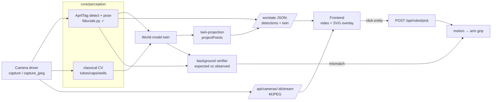

# Camera feed + live entity overlay — integration plan

Goal: show the camera feeds in the frontend, **highlight the entities we identify**
(AprilTag + classical OpenCV), let the operator click an entity to **move-and-grip** it,
and keep the cameras **continuously validating** that the world matches the twin.

This is the visible surface of the world-model loop already specced in
`WORLD_MODEL_REQUIREMENTS.md` / `IMPLEMENTATION_PLAN.md`. Nothing new architecturally —
it exposes and closes the loop that calibration → twin → verification already define.

---

## 0. Decisions locked

- **Transport: MJPEG + JSON overlay.** Backend streams raw camera MJPEG; detections
  (ids, polygons, world poses) ride the existing `/ws/state` as JSON; the frontend draws a
  crisp SVG overlay on top. Video and overlay are decoupled and independently debuggable.
- **Recognition: AprilTag (tag36h11) + classical OpenCV**, plus **twin-projection** for
  known/calibrated geometry (below). No GPU. SAM2/YOLO stay the T1/T2 upgrade.

---

## 0b. The three-camera rig

All three resolve into one shared world frame; each owns a job and a set of verification
predicates. Redundant coverage (the same event seen by two cameras) is a feature — it lets
the verifier cross-check and pick the best viewpoint per step.

| Camera (twin id / fleet id) | Mount | Frame / calibration | Best at | Owns predicates |
|-----------------------------|-------|---------------------|---------|-----------------|
| **`gripper_cam`** | On the arm gripper (eye-in-hand), moves with the arm | Child of `right_tcp`; **hand-eye** (FR-CAL-2) | Close-up precision on whatever the arm is holding/approaching; markerless detail; scanning tags while moving | `grasp_secure`, `cap_removed` (threads/close view) |
| **`overview_cam`** | Fixed, oversees both devices | World-fixed; **extrinsics from fixed tags** (FR-CAL-3) | Global twin state, the main UI feed, coarse tracking of every entity, detecting drift of static instruments | layout/occupancy drift; primary operator view |
| **`handover_cam`** | Fixed, aimed at the arm→liquid-handler handover zone | World-fixed; extrinsics from fixed tags | The tightest-tolerance moment: tube presented to the nozzle/nest, and the aspiration handover | `tube_aligned` (present), `aspiration_ok` |

Why this split matters:

- **Fixed tags in view of the fixed cams** (`overview_cam`, `handover_cam`) are what
  calibrate the space — fixed tag36h11 markers (a world board / stuck-down tags) give each
  fixed camera its `T_world_cam` in one shot, and a tag seen by *both* fixed cams validates
  that their extrinsics agree (the FR-CAL-4 shared-frame cross-check).
- **The gripper cam is the precision instrument** — it can't see the whole cell, but when the
  arm is at a tube/cap it gives the closest, least-occluded view for grasp and cap-off checks,
  and it doubles as the moving scanner that locates instruments during calibration.
- **The handover cam de-risks the one step most likely to fail** — presenting the tube to the
  pipette. A dedicated fixed close-up there means `tube_aligned` and the aspiration are
  verified from the best possible angle, independent of where the arm cam happens to be.

Predicate → camera routing lives in the background verifier: each agent reads the camera(s)
that see its event, falling back to another view if one is occluded.

## 1. How it ties into the rest (the key idea)

Two calibration facts make the overlay and the grip *almost free* once the space is set up:

1. **Fixed tags calibrate the space** → we know each camera's pose in the world frame
   (`T_world_cam`, from `core/calibration/`). 
2. **We know entity geometry** → dimensions from the CAD meshes (`core/worldmodel/meshes.py`)
   and grid layout from `definitions.py`.

So the overlay has **two sources**, fused:

- **Twin-projection (for known, calibrated entities):** project twin entities (rack wells,
  deck slots, a tracked tube) into the image using `T_world_cam` + intrinsics
  (`cv2.projectPoints`). No per-frame detection needed — if the space is calibrated, the
  boxes are already correct. This is what makes highlighting reliable.
- **Live detection (corrective + un-modeled objects):** AprilTag gives a *corrective* pose
  for anything wearing a tag (tube cap = id 224, bases, OT, rack); classical OpenCV
  (Hough circles / contours) finds tube tops, caps and empty wells that aren't tagged.

Detection updates the twin (`WorldModel.set_world_pose`, via `entity_world_pose()` from
`core/perception/fiducials.py`); twin-projection reads the twin back out for the overlay.
That round-trip **is** the "cameras keep validating everything" behaviour — the background
verifier compares *expected* (twin) vs *observed* (detection) and flags drift.



---

## 2. Backend

Camera capability already exposes `capture()` (BGR ndarray) and `capture_jpeg()` — so both
sides are cheap.

- **New router `backend/app/api/cameras.py`** (register in `main.py` next to the others):
  - `GET /api/cameras` → list camera ids + resolution.
  - `GET /api/cameras/{id}/stream` → `multipart/x-mixed-replace; boundary=frame` MJPEG via a
    `StreamingResponse` generator that yields `capture_jpeg()` at ~15 fps.
- **Detection publishing:** a small service loop runs the perception (`FiducialDetector` +
  classical CV) per camera and writes results into the twin + a shared `detections` dict.
  The existing `/ws/state` snapshot (already served from `api/workflow.py`) gains a
  `cameras` block. This is the **background verifier** (`core/verification/loop.py` from the
  main plan) — the UI and the validator read the same stream.

**`/ws/state` shape (additive):**
```json
{
  "entities": [ ... existing twin snapshot ... ],
  "verdicts": { "tube_aligned": {"ok": true, "confidence": 0.9}, ... },
  "cameras": {
    "overview_cam": {
      "w": 1920, "h": 1080,
      "detections": [
        {"kind":"apriltag","marker_id":224,"entity_id":"tube_1_cap",
         "polygon":[[0.31,0.42],...],           // normalized [0..1] image coords
         "world_xyz":[0.12,0.34,0.05],"confidence":0.97},
        {"kind":"tube","entity_id":"tube_1","polygon":[...],"source":"projection"}
      ]
    }
  }
}
```
Normalized coords mean the frontend scales cleanly to any displayed size.

## 3. Perception additions (`core/perception/`)

- `fiducials.py` — **done** (tag36h11 detect + pose + entity resolution).
- `shapes.py` — **new**, classical OpenCV: `cv2.HoughCircles` for tube openings / cap discs,
  contour + colour for the green rack; returns normalized polygons + a guessed `kind`.
- `projection.py` — **new**: `project_entity(wm, entity_id, cam)` → image polygon for a twin
  entity using `T_world_cam` + intrinsics + the entity's `dims`/mesh bbox. Drives the
  reliable overlay for calibrated geometry.
- All three feed one `detect_frame(cam) -> list[Detection]` the stream loop calls per camera.

## 4. Frontend (`frontend/src`)

- **`composables/useCameraFeed.ts`** — expose the MJPEG URL(s) for ``/`<video>`.
- **`composables/useDetections.ts`** — subscribe `/ws/state`, expose `cameras[id].detections`
  (mirrors the existing `useFleet`/`useWorkflow` pattern + `api/client.ts`).
- **`components/CameraView.vue`** — an `` with an absolutely-positioned
  `<svg viewBox="0 0 1 1" preserveAspectRatio>` on top; draw each detection's polygon +
  label (`id`, `entity_id`, distance). Colour by kind (tag / tube / cap / well) and by
  verdict (green=verified, amber=drifting, red=mismatch).
- **Click-to-act:** clicking a polygon emits `pick(entity_id)` → `POST /api/robot/pick`.
- Drop `CameraView` into `App.vue` beside `InstrumentPanel` / `WorkflowRunner`.

## 5. Move-and-grip (uses the dimensions)

`POST /api/robot/pick { entity_id }`:
1. Look up the entity in the twin → `world_pose(entity_id)` + `dims` (Ø, height from CAD).
2. Grasp planner (`core/motion/pick_place.py`, already present) builds approach + grip:
   gripper width = `diameter + clearance`, grasp height along the tube axis, top-down or
   side approach from the entity's orientation.
3. Execute via the arm capability (open-loop); then **verify the grasp**
   (`GraspSecureAgent`) — width band + the tube still highlighted in-frame.
4. On failure → recovery (regrasp), per the closed-loop-only-on-error principle.

This is exactly your "we know the entity and its dimensions, so instruct the robot to move
there and grip it" — the twin supplies pose, the CAD supplies size.

## 6. Continuous validation (the cameras keep checking)

The same per-camera detection loop feeds the background verifier (5–15 Hz):

- **Presence/pose drift:** compare each detected tag's `world_xyz` to the twin's expected
  pose → if `‖observed − expected‖ > τ`, mark the entity `drifting` (amber) and, if it
  crosses a hard threshold, fail the relevant predicate → recovery re-localizes.
- **Occupancy:** classical CV on wells/slots confirms occupied/empty vs twin state.
- **Post-action checks:** after a grip/uncap/present, the overlay colour flips live as the
  predicate re-evaluates — the operator *sees* verification happen.

No new subsystem — the overlay JSON and the verifier are the same detections viewed two ways.

---

## 7. Build blocks (fits the demo-first tiers)

| Block | Exit criteria | Owner | Tier |
|-------|---------------|-------|------|
| **C1 (~1 h)** | `GET /api/cameras/:id/stream` shows live MJPEG in a bare `` | Lukas/Di | T0 |
| **C2 (~1 h)** | `/ws/state` carries `cameras.detections`; `CameraView.vue` overlays AprilTag polygons + ids | Di | T0 |
| **C3 (~1 h)** | `projection.py` draws calibrated wells/rack/tube from the twin (needs intrinsics + `T_world_cam`) | Di | T0 |
| **C4 (~1 h)** | Click a highlighted tube → `POST /api/robot/pick` → arm moves + grips using dims → `grasp_secure` verifies | Dale/Lukas | T0 |
| **C5 (~1 h)** | Overlay colour reflects live verdicts; drift shows amber, mismatch red | Di | T0/T1 |
| **C6 (T1)** | `shapes.py` classical CV highlights un-tagged tubes/caps/empty wells | Di | T1 |

Depends on the main plan's **B2** (intrinsics + `T_world_cam`); C1–C2 can be built against a
mock camera driver + recorded frames before hardware is free.

## 8. Contracts to freeze early

- `/ws/state.cameras[id].detections[]` — normalized `polygon`, `kind`, `entity_id`,
  optional `world_xyz`, `confidence`, `source` (`apriltag|cv|projection`).
- `GET /api/cameras/{id}/stream` — MJPEG `multipart/x-mixed-replace`.
- `POST /api/robot/pick { entity_id }` → `{ ok, detail }` (async → progress on `/ws/workflow`).

## 9. Open questions

- One canonical validating camera for the demo, or all feeds tiled? (Start with the external
  cam; add the arm cam if time.)
- Grasp approach per family (top-down vs side) — set from the tube family in `definitions.py`.
- Overlay refresh: detections at the verifier rate (5–15 Hz) vs the MJPEG fps — decouple so a
  slow detector never stalls the video.
