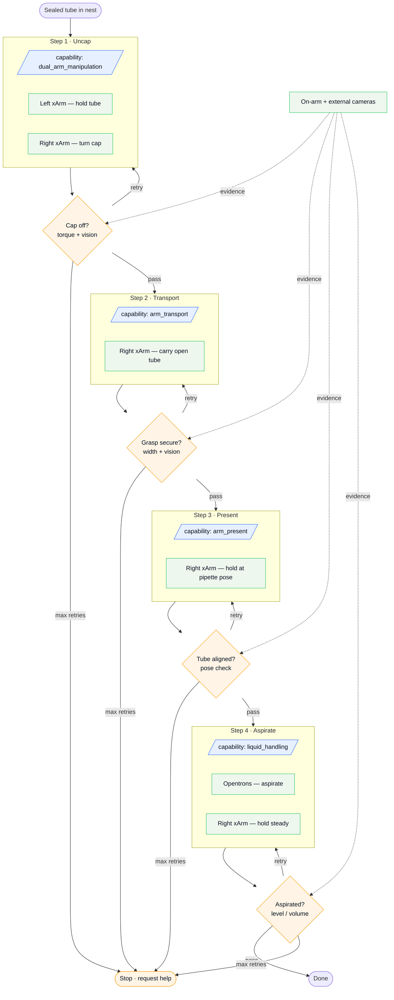
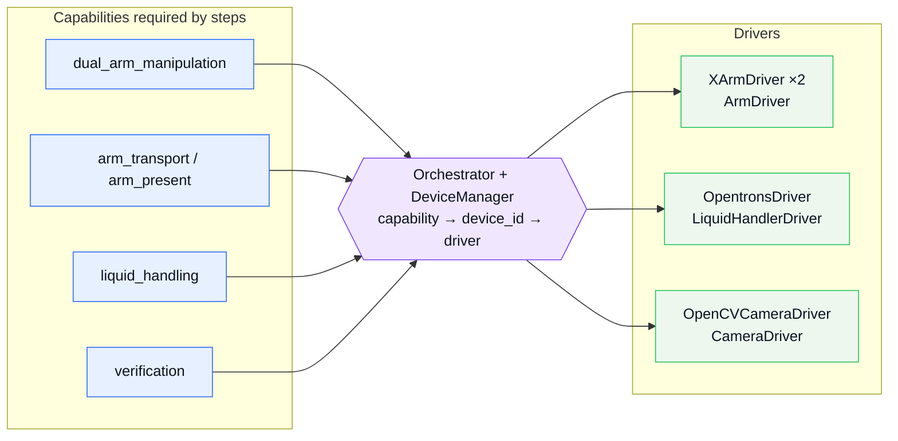

# Workflow — Cooperative Uncap → Aspirate

Each step names the **devices** involved and the **capability** required. Cameras feed
the verification agents that gate every step; a failed check retries the step, and after
`MAX_ATTEMPTS` the chain stops and asks for help.

## Capability → driver mapping (the orchestration middle layer)

The orchestrator (`backend/app/workflows/`) resolves each step's capability to concrete
drivers via the `DeviceManager`. Capabilities are decoupled from hardware, so drivers are
swappable/mockable.

